# Curso de Frontend Developer <!-- omit in toc -->

## Tabla de Contenido<!-- omit in toc -->

- [¿Qué es HTML y CSS? ¿Para qué sirven?](#qué-es-html-y-css-para-qué-sirven)
  - [¿Qué es HTML?](#qué-es-html)
  - [¿Qué es CSS?](#qué-es-css)
  - [Para qué sirven las herramientas del navegador](#para-qué-sirven-las-herramientas-del-navegador)
- [Motores de render](#motores-de-render)
  - [¿Cuáles son los motores del navegador?](#cuáles-son-los-motores-del-navegador)
  - [Proceso de renderizado del motor del navegador](#proceso-de-renderizado-del-motor-del-navegador)
- [Anatomía de un documento HTML y sus elementos](#anatomía-de-un-documento-html-y-sus-elementos)
  - [Qué son atributos HTML](#qué-son-atributos-html)
  - [Qué son los elementos vacíos](#qué-son-los-elementos-vacíos)
  - [Qué es el anidamiento de elementos](#qué-es-el-anidamiento-de-elementos)
  - [Estructura básica de un documento HTML](#estructura-básica-de-un-documento-html)
    - [Etiqueta Doctype](#etiqueta-doctype)
    - [Etiqueta html](#etiqueta-html)
    - [Etiqueta head](#etiqueta-head)
    - [Etiqueta body](#etiqueta-body)
    - [Comentarios de HTML](#comentarios-de-html)
- [¿Qué es HTML semántico?](#qué-es-html-semántico)
  - [El problema con la etiqueta div](#el-problema-con-la-etiqueta-div)
  - [¿Cuáles son las etiquetas semánticas?](#cuáles-son-las-etiquetas-semánticas)
  - [Ventajas de utilizar HTML semántico](#ventajas-de-utilizar-html-semántico)
- [Anatomía de una declaración CSS](#anatomía-de-una-declaración-css)
  - [Qué es una declaración de CSS](#qué-es-una-declaración-de-css)
  - [Propiedades iniciales de CSS](#propiedades-iniciales-de-css)
  - [Medidas iniciales](#medidas-iniciales)
- [Tipos de selectores](#tipos-de-selectores)
  - [Cuáles son los selectores básicos](#cuáles-son-los-selectores-básicos)
    - [Selector de tipo](#selector-de-tipo)
    - [Selector de clase](#selector-de-clase)
    - [Selector de identificador único (id)](#selector-de-identificador-único-id)
    - [Selector de atributo](#selector-de-atributo)
    - [Selector universal](#selector-universal)
  - [Cuáles son los selectores combinadores](#cuáles-son-los-selectores-combinadores)
    - [Combinador de descendientes](#combinador-de-descendientes)
    - [Combinador de hijo directo](#combinador-de-hijo-directo)
    - [Combinador de elemento adyacente](#combinador-de-elemento-adyacente)
    - [Combinador general de hermanos](#combinador-general-de-hermanos)
- [Pseudoclases y Pseudoelementos](#pseudoclases-y-pseudoelementos)
  - [Cuáles son las pseudoclases](#cuáles-son-las-pseudoclases)
  - [Cuáles son los pseudoselementos](#cuáles-son-los-pseudoselementos)
- [Cascada y especificidad en CSS](#cascada-y-especificidad-en-css)
  - [Qué es la cascada en CSS](#qué-es-la-cascada-en-css)
  - [Qué es especificidad en CSS](#qué-es-especificidad-en-css)
    - [Tipos de especificidad en CSS](#tipos-de-especificidad-en-css)
    - [Valor con mayor especificidad](#valor-con-mayor-especificidad)
    - [Estilos en línea](#estilos-en-línea)
    - [Especificidad en selectores](#especificidad-en-selectores)
- [Tipos de display](#tipos-de-display)
  - [Visualización en bloque (block)](#visualización-en-bloque-block)
  - [Visualización en línea (inline)](#visualización-en-línea-inline)
  - [Visualización de bloque y línea (inline-block)](#visualización-de-bloque-y-línea-inline-block)
  - [Visualización nula (none)](#visualización-nula-none)
  - [CSS Layouts](#css-layouts)
    - [Flexbox](#flexbox)
    - [Grid](#grid)
- [Modelo de caja](#modelo-de-caja)
  - [Qué es el contenido del elemento HTML](#qué-es-el-contenido-del-elemento-html)
  - [Qué son los bordes del elemento HTML](#qué-son-los-bordes-del-elemento-html)
  - [Qué es el espaciado interno del elemento HTML o padding](#qué-es-el-espaciado-interno-del-elemento-html-o-padding)
  - [Qué es el espaciado externo del elemento HTML o margin](#qué-es-el-espaciado-externo-del-elemento-html-o-margin)
  - [Qué son los valores por defecto](#qué-son-los-valores-por-defecto)
  - [Qué es el tamaño total del elemento](#qué-es-el-tamaño-total-del-elemento)
  - [Propiedad box-sizing](#propiedad-box-sizing)
  - [¿Cuál es el problema con el tamaño de los bordes?](#cuál-es-el-problema-con-el-tamaño-de-los-bordes)
- [Colapso de márgenes](#colapso-de-márgenes)
- [Posicionamiento en CSS](#posicionamiento-en-css)
  - [Propiedades de posición](#propiedades-de-posición)
  - [Posición estática](#posición-estática)
  - [Posición relative](#posición-relative)
  - [Posición absoluta](#posición-absoluta)
  - [Elemento padre más próximo con posición relativa](#elemento-padre-más-próximo-con-posición-relativa)
  - [Posición fija](#posición-fija)
  - [Posición variable fija](#posición-variable-fija)
- [Z-index y el contexto de apilamiento](#z-index-y-el-contexto-de-apilamiento)
  - [Qué son los planos y ejes](#qué-son-los-planos-y-ejes)
  - [Qué es la propiedad z-index](#qué-es-la-propiedad-z-index)
- [Unidades de medida](#unidades-de-medida)
  - [Qué son las medidas absolutas](#qué-son-las-medidas-absolutas)
  - [Qué son las medidas relativas](#qué-son-las-medidas-relativas)
  - [Diferencia entre rem y em](#diferencia-entre-rem-y-em)
  - [Diferencia entre porcentajes y la anchura y altura de la pantalla](#diferencia-entre-porcentajes-y-la-anchura-y-altura-de-la-pantalla)
  - [Problema con las medidas de texto](#problema-con-las-medidas-de-texto)
- [Responsive Design](#responsive-design)
  - [Qué son las media queries](#qué-son-las-media-queries)
  - [Estructura de la media querie](#estructura-de-la-media-querie)
- [¿Qué son las arquitecturas CSS?](#qué-son-las-arquitecturas-css)
  - [Objetivos de las arquitecturas de CSS](#objetivos-de-las-arquitecturas-de-css)
  - [Buenas prácticas de las arquitecturas de CSS](#buenas-prácticas-de-las-arquitecturas-de-css)
  - [Qué es CSS orientado a objetos](#qué-es-css-orientado-a-objetos)
  - [Qué es BEM: bloque, elemento y modificador](#qué-es-bem-bloque-elemento-y-modificador)
  - [Qué es la arquitectura escalable y modular de CSS](#qué-es-la-arquitectura-escalable-y-modular-de-css)
  - [Qué es el triángulo invertido de CSS](#qué-es-el-triángulo-invertido-de-css)
  - [Qué es el diseño atómico](#qué-es-el-diseño-atómico)

<style type="text/css">
    img {
      display: block;
      width: 50%;
      margin: auto;
    }
</style>

## ¿Qué es HTML y CSS? ¿Para qué sirven?

La web se construye mediante tres tecnologías esenciales: HTML, CSS y JavaScript. Estos tres lenguajes son las bases en que una aplicación o página web está construida.

### ¿Qué es HTML?

El Lenguaje de Marcado de Hipertexto o HTML por sus siglas en inglés (HyperText Markup Language) es el código para construir la estructura de una página web.

En otras palabras, HTML es el esqueleto con el cual definimos cada elemento que compone la página web, así como: enlaces, párrafos, títulos, botones, imágenes, formularios, entre otros.

### ¿Qué es CSS?

El lenguaje de Hojas de Estilos en Cascada o CSS por sus siglas en inglés (Cascade Style Sheets) es el código para describir la presentación de los elementos de la página web, los que definimos con HTML.

### Para qué sirven las herramientas del navegador

Las herramientas del navegador son importantes para visualizar lo que ocurre con el código generado. Entre una de la opciones está identificar los elementos que están estructurados en la página web con sus respectivos estilos.

Las herramientas de desarrollador se despliegan con la combinación de teclas F12 / Ctrl + Shift + I / Cmd + Opt + I o clic derecho e “Inspeccionar” en tu navegador preferido (se recomienda Google Chrome).

[🡡 volver al inicio](#tabla-de-contenido)

## Motores de render

Los motores de renderizado son programas que traducen nuestro código en un lenguaje que entienda el navegador, de esta manera el programa sabrá que es lo que tiene que mostrar por pantalla al usuario.

### ¿Cuáles son los motores del navegador?

Los navegadores tienen sus propios motores: Chrome - Blink, Edge - Edge HTML, Safari - Webkit y Firefox - Gecko. Todos realizan esta compilación de manera diferente, pero con el mismo resultado, es decir, convierten los archivos a píxeles.

### Proceso de renderizado del motor del navegador

El motor del navegador realiza 5 pasos o procesos para compilar nuestro código hasta el renderizado por pantalla. Estos pasos son los siguientes:

1. Transforma los archivos a un árbol de objetos HTML o CSS, estos se denominan DOM (Document Object Model) y CSSDOM (Cascade Style Sheet Object Model), respectivamente. Cada nodo en el árbol es una representación de los elementos que contiene el archivo HTML o CSS.
2. Calcula el estilo correspondiente a cada nodo del DOM relacionado al CSSDOM.
3. Calcula las dimensiones de cada nodo y dónde va en la pantalla.
4. Pinta o renderiza los diferentes elementos como cajas o contenedores.
5. Agrupa todas las cajas en diferentes capas para convertirlas en una imagen que se renderiza en pantalla.

[🡡 volver al inicio](#tabla-de-contenido)

## Anatomía de un documento HTML y sus elementos

Antes de empezar a escribir código HTML, debemos conocer la anatomía de un documento y sus elementos.
¿Cuáles son los elementos HTML?

Los elementos son cada una de las partes que conforman un archivo HTML. Su estructura contiene:

- Etiquetas: es la representación de un elemento HTML. Se dividen en etiquetas de apertura, representadas por `<etiqueta>` y etiquetas de cierre, representadas por `</etiqueta>`.
- Contenido: es el texto o elementos encerrados por la etiqueta, este valor es opcional en algunas de ellas.

### Qué son atributos HTML

Los atributos HTML son propiedades en la etiqueta de apertura que manejan el comportamiento del elemento. Su valor está envuelto en comillas.

### Qué son los elementos vacíos

Los elementos vacíos son aquellos que únicamente se representan en una etiqueta de apertura. Por ejemplo, la etiqueta de imagen: ``. Estas etiquetas pueden cerrarse en la misma etiqueta de apertura, utilizando la barra inclinada “/” al final: ``.

### Qué es el anidamiento de elementos

El anidamiento de elementos HTML consiste en envolver varias etiquetas en otras etiquetas.

Interpreta a cada elemento HTML como una caja donde puedes guardar diferentes elementos u otras cajas. Estas cajas tendrán diferentes tamaños y estarán colocadas junto a otras.

```html
<section>
  <h1>Platzi</h1>
  <p>Tiene una comunidad</p>
  <ul>
    <li>Increible</li>
    <li>Maravillosa</li>
    <li>Inigualable</li>
  </ul>
</section>
```

Aquellas etiquetas que envuelven a otras se las denomina “padres”. Es decir, `<section>` es padre de `<h1>`, `<p>`, `<ul>`, y a su vez `<ul>` es padre de 3 etiquetas `<li>`.

Las etiquetas que son el contenido de otras, se las denomina “hijos”. Es decir, las etiquetas `<h1>`,`<p>`, `<ul>` son hijos de `<section>`, y a su vez las etiquetas `<li>` son hijos de `<ul>`.

### Estructura básica de un documento HTML

La estructura básica de un documento HTML está configurado por las siguientes etiquetas principales:

#### Etiqueta Doctype

La etiqueta `<!DOCTYPE html>` especifica que el archivo se maneje con la versión 5 de HTML.

#### Etiqueta html

La etiqueta `<html>` define el elemento raíz de un documento HTML. Todos los demás elementos deben estar contenidos dentro de este elemento raíz. En esta etiqueta se especifica el lenguaje de la página web mediante la propiedad lang.

#### Etiqueta head

La etiqueta `<head>` define la metainformación, es decir, toda información que no es contenido como tal de la página web. Por ejemplo, los enlaces a archivos CSS y JavaScript, el título y la imagen que aparecen en la pestaña del navegador. Esto es importante para motores de búsqueda como Google.

#### Etiqueta body

La etiqueta `<body>` define el contenido de la página web. Debe ser hijo cercano de `<html>` y padre de todas las etiquetas HTML, excepto por aquellas que definan metainformación.

#### Comentarios de HTML

Los comentarios de HTML consiste en señalar algo que se ignorará. Para establecer un comentario HTML se lo envuelve entre <!-- y -->, independiente de la cantidad de líneas.

```html
<!-- Este es un comentario de una línea -->

<!--
Este es un comentario de varias líneas
-->
```

[🡡 volver al inicio](#tabla-de-contenido)

## ¿Qué es HTML semántico?

El HTML semántico consiste en que cada elemento tenga su propia etiqueta que lo defina correctamente. Sin utilizar etiquetas muy generales, como `<div>` o `<span>`.

### El problema con la etiqueta div

La etiqueta div define un bloque genérico de contenido, que no tiene ningún valor semántico. Se utiliza para elementos de diseño como contenedores.

### ¿Cuáles son las etiquetas semánticas?

Las etiquetas semánticas para definir una interfaz de una página web son:

- `<header>`: define el encabezado de la página (no confundir con `<head>`).
- `<nav>`: define una barra de navegación que incluye enlaces.
- `<section>`: define una sección de la página.
- `<footer>`: define un pie de página o de sección.
- `<article>`: define un artículo, el cual puede tener su propio encabezado, navegación, sección o pie de página.

Ahora que ya conoces las etiquetas semánticas, evita el uso excesivo de `<div>`.

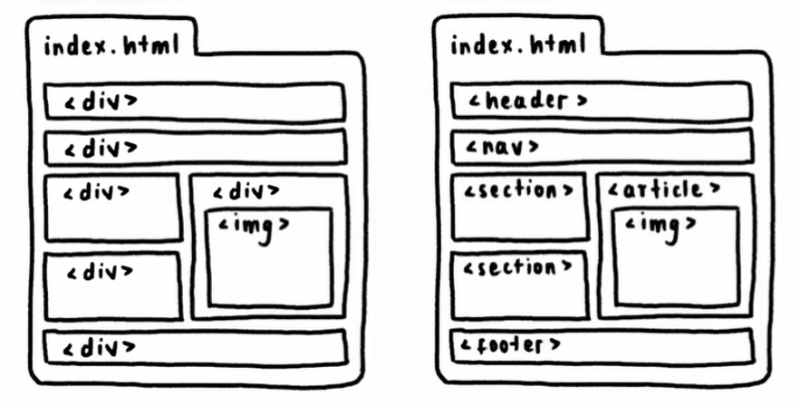

### Ventajas de utilizar HTML semántico

Las ventajas de utilizar un HTML semántico son:

- Ayuda a tu sitio a ser accesible
- Mejora tu posicionamiento (SEO)
- Código más claro, legible y mantenible
- Ayuda a buscadores (como Google) a encontrar tu página

[🡡 volver al inicio](#tabla-de-contenido)

## Anatomía de una declaración CSS

Antes de empezar a escribir código CSS, debemos conocer la anatomía de una declaración de estilos.

### Qué es una declaración de CSS

Una declaración de CSS es un bloque que especifica el conjunto de estilos que se añadirán a un elemento HTML. Su estructura contiene lo siguiente:

- Selector: define el elemento o conjunto de elementos a los cuales se añadirán los estilos.
- Propiedad: es el nombre del estilo de CSS.
- Valor: es el valor que tomará la propiedad.

### Qué son comentarios de CSS

Los comentarios de CSS consisten en señalar algo que se ignorará. Para establecer un comentario CSS se lo envuelve entre `/*` y `*/`, independiente de la cantidad de líneas.

```css
/* Este es un comentario de una línea */
/* 
Este es un comentario de varias líneas
*/
```

### Propiedades iniciales de CSS

Antes de empezar con CSS utilizaremos algunas propiedades de CSS.

- color: establece el color del texto de un elemento.
- background-color: establece un color de fondo al elemento.
- font-size: establece el tamaño de la fuente.
- width: establece la anchura de un elemento.
- height: establece la altura de un elemento.

### Medidas iniciales

Estas son las medidas iniciales que debes conocer para establecer tamaños de elementos o de tipografía:

- px: establece una longitud de píxeles.
- %: establece un porcentaje con respecto a una medida base.

[🡡 volver al inicio](#tabla-de-contenido)

## Tipos de selectores

El selector define el elemento o conjunto de elementos HTML a los cuales se añadirán estilos. Existen nombres de colores propios de CSS que puedes explorar. A continuación veamos más sobre selectores.

### Cuáles son los selectores básicos

Un selector básico es la mínima expresión CSS para colocar estilos.

```css
selector {
  /* Estilos */
}
```

#### Selector de tipo

Selecciona todos los elementos que coincidan con el nombre de la etiqueta HTML.

```css
div {
  /* Todos los div en el documento */
}
```

#### Selector de clase

Selecciona todos los elementos que coincidan con las etiquetas HTML que contengan el atributo class.

```html
<!--archivo HTML-->
<div class="card">Soy una carta</div>
```

Para seleccionar estos elementos, se empieza por un punto . y seguido el valor exacto del atributo class de la etiqueta. Puede ser cualquier valor que desees colocar.

```css
/* archivo CSS */
.card {
  /* Todas las etiquetas con la clase "card" */
}
```

Puede existir más de un valor dentro del atributo class separados por espacios.

```html
<!--archivo HTML-->
<div class="card card1">Soy una carta</div>
<div class="card card2">Soy una carta</div>
```

```css
.card {
  /* Todas las etiquetas con la clase "card" */
}

.card1 {
  /* Todas las etiquetas con la clase "card1" */
}

.card2 {
  /* Todas las etiquetas con la clase "card2" */
}
```

#### Selector de identificador único (id)

Selecciona el único elemento que coincida con la etiqueta HTML que contenga el atributo id. Solo puede existir un valor id para todo el documento.

```html
<!--archivo HTML-->
<button id="eliminar">Eliminar</button>
```

Para seleccionar el elemento, se empieza por el símbolo de hashtag # y seguido el valor exacto del atributo id de la etiqueta. Puede ser cualquier valor que desees colocar.

```css
/* archivo CSS */
#eliminar {
  /* La única etiqueta con el id "eliminar" */
}
```

#### Selector de atributo

Selecciona los elementos que coincidan con la etiqueta HTML que contenga el atributo y valor especificado.

```html
<!--archivo HTML-->
<a href="https://platzi.com"> Ir a Platzi </a>
```

Para seleccionar los elementos, se empieza por el nombre de la etiqueta, seguido de corchetes [] que contiene el atributo y valor especificado.

```css
/* archivo CSS */
a[href=""https://platzi.com"]
{
  /* Todas las etiquetas <a> con una propiedad href con valor "https://platzi.com" */
}
```

#### Selector universal

Selecciona todos los elementos del documento mediante un asterisco \*.

```css
* {
  /* Todos los elementos */
}
```

### Cuáles son los selectores combinadores

Un selector combinador es la unión de dos o más selectores básicos.

```css
selector1 selector2 selector3 {
  /* Estilos */
}
```

#### Combinador de descendientes

Selecciona todos los elementos del selector de la derecha que son hijos del selector de la izquierda, independientemente de la profundidad. Estos selectores están separados por un espacio.

```css
padre hijos {
  /* Todos los hijos del padre */
}

div p {
  /* Todos los hijos <p> de <div>*/
}

.container img {
  /* Todos los hijos  de la clase "container"*/
}
```

#### Combinador de hijo directo

Selecciona todos los elementos del selector de la derecha que son hijos directos del selector de la izquierda. Estos selectores están separados por >.

```css
padre > hijos_directos {
  /* Todos los hijos directos del padre */
}

div > p {
  /* Todos los hijos directos <p> de <div>*/
}

.container > img {
  /* Todos los hijos directos  de la clase "container"*/
}
```

#### Combinador de elemento adyacente

Selecciona todos los elementos del selector de la derecha que están adyacente al selector de la izquierda. Estos selectores están separados por +.

```css
elemento + adyacente {
  /* Elementos adyacentes */
}

div + p {
  /* Todos los <p> adyacentes a <div>*/
}

.container + img {
  /* Todos los  adyacentes a la clase "container"*/
}
```

Adyacente significa que comparten el mismo padre y está situado inmediatamente hacia abajo de otro elemento. Por ejemplo, en el siguiente código, `<div>` está adyacente a `<h1>` y `<p>` está adyacente a `<div>`. Sin embargo, `<h1>` no está adyacente a `<div>` y `<div>` no está adyacente a `<p>`.

```html
<!--archivo HTML -->
<h1>Soy un título</h1>
<div>Soy un div</div>
<p>Soy un párrafo</p>
```

#### Combinador general de hermanos

Selecciona todos los elementos del selector de la derecha que son hermanos del selector de la izquierda. Estos selectores están separados por ~.

```css
elemento ~ hermanos {
  /* Elementos hermanos */
}

div ~ p {
  /* Todos los <p> hermanos de <div>*/
}

.container ~ img {
  /* Todos los  hermanos de la clase "container"*/
}
```

Hermanos significa que comparten el mismo padre y están situados hacia abajo de otro elemento. Por ejemplo, en el siguiente código, `<div>` y `<p>` son hermanos de `<h1>`, pero `<h1>` no es hermano de `<div>` y `<p>`.

```html
<!--archivo HTML -->
<h1>Soy un título</h1>
<div>Soy un div</div>
<p>Soy un párrafo</p>
```

[🡡 volver al inicio](#tabla-de-contenido)

## Pseudoclases y Pseudoelementos

Existen otros tipos de selectores, además de los selectores básicos y combinadores, capaces de cambiar un estado o añadir algo más al elemento. Estos son denominados pseudoclases y pseudoelementos.

### Cuáles son las pseudoclases

Una pseudoclase define el estilo de un estado especial de un elemento. [Índice de pseudo-clases estándar.](https://developer.mozilla.org/es/docs/Web/CSS/Pseudo-classes#indice_de_las_pseudo-clases_est%C3%A1ndar)

```css
selector: pseudoclase {
  propiedad: valor;
}
```

- :hover

  Representa el estado en el cual el cursor está encima del elemento.

- :active

  Representa el estado de un elemento que no ha sido visitado.

- :visited

  Representa el estado de un elemento que ya ha sido visitado.

- :not()

  Representa el estado en el cual no coinciden los selectores que se indiquen.

- :nth-child()

  Representa el estado en el cual coinciden los hijos del elemento según el valor indicado.

Valores de palabras clave:

- odd: los elementos hijos en posiciones impares.
- even: los elementos hijos en posiciones pares.

Fórmula matemática: An+B donde A y B son números enteros.

### Cuáles son los pseudoselementos

Un pseudoelemento define el estilo de una parte específica de un elemento. [Lista de pseudo-elementos.](https://developer.mozilla.org/es/docs/Web/CSS/Pseudo-elements#lista_de_pseudoelementos)

```css
selector :: pseudo-elemento {
  propiedad: valor;
}
```

- ::before

  Sirve para agregar un contenido antes del elemento. El contenido es agregado mediante la propiedad content de CSS.

- ::after

  Sirve para agregar un contenido después del elemento. El contenido es agregado mediante la propiedad content de CSS.

- ::first-letter

  Sirve para añadir estilos a a la primera letra del texto de cualquier elemento.

[🡡 volver al inicio](#tabla-de-contenido)

## Cascada y especificidad en CSS

En algún punto, cuando estés creando una página web, te encontrarás con problemas con los estilos, por ejemplo:

- ¿Por qué no se aplica el color que le estoy poniendo?
- ¿Por qué este elemento se comporta de manera diferente?

Probablemente, sea un inconveniente de cascada o especificidad.

### Qué es la cascada en CSS

La cascada es el concepto que determina qué estilos se colocan sobre otros, priorizando a aquellos que se encuentren más abajo del código. Recordarás que CSS es la abreviación de Cascade Style Sheets, que traducido es hojas de estilos en Cascada.

Mira el siguiente código e identifica de qué color de letra tendrá la etiqueta `<h1>`.

```css
h1 {
  color: red;
}

h1 {
  color: blue;
}
```

La etiqueta `<h1>` tendrá un color blue de letra, esto porque está situado más abajo en el código. Esto ocurre con cada propiedad de CSS que se repita en algún punto más arriba del código.

Sin embargo, esto ocurre cuando la especificidad de una regla CSS tiene el mismo valor. Pero, ¿qué es especificidad?

### Qué es especificidad en CSS

La especificidad consiste en dar un valor a una regla CSS sobre qué tan específico es el estilo, esto para que los navegadores puedan saber qué estilos aplicar sobre otros, independientemente de dónde se encuentren en el código. El estilo se aplicará donde la especificidad sea mayor.

#### Tipos de especificidad en CSS

Existen 6 tipos de especificidad con su respectivo valor, donde X es la cantidad de estilos que lo contienen.


#### Valor con mayor especificidad

La palabra reservada !important es un valor de toda propiedad CSS que provee una especificidad de 10000, por lo que se aplicará ante otros estilos. Esto es una mala práctica y no deberías utilizarlo.

```css
h1 {
  color: red !important;
}
```

#### Estilos en línea

Los estilos en línea son las propiedades CSS escritas en el HTML a través de la propiedad style de toda etiqueta. También es una mala práctica y debes evitarlo.

```html
<h1 style="color: blue;">Especificidad</h1>
```

#### Especificidad en selectores

El tema de los selectores ya lo conoces, por lo tanto, los selectores de tipo ID son más específicos que las clases, atributos y pseudoclases. Estas últimas son más específicas que los elementos y pseudoelementos. El selector universal tiene una especificidad de 0.

En un proyecto deberías evitar los !important y estilos en línea, para trabajar únicamente con la especificidad de los selectores. Sin embargo, debes tener presente que los selectores combinadores suman la especificidad de cada selector básico para obtener la especificidad total de la regla CSS.

[🡡 volver al inicio](#tabla-de-contenido)

## Tipos de display

La propiedad display establece el tipo de visualización de los elementos HTML sin afectar el flujo normal de los elementos.

Existen etiquetas que por defecto su display ya está determinado, como la etiqueta `<div>` que tiene display block, `<span>` tiene display inline y `<button>` tiene display inline-block.

### Visualización en bloque (block)

El display block establece que un elemento ocupará todo el espacio disponible por defecto y el siguiente elemento a este se situará por debajo.

Es posible añadir medidas de anchura width y altura height a estos a elementos.

También es posible agregar todas las propiedades del modelo de caja.

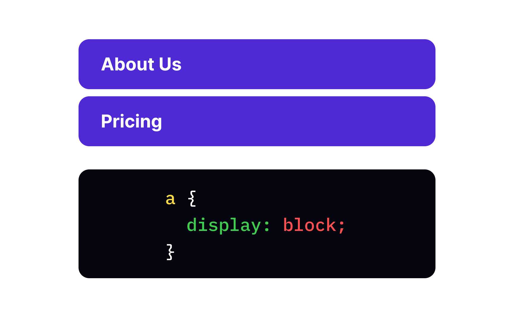

### Visualización en línea (inline)

El display inline establece que un elemento ocupará el espacio del contenido del mismo y el siguiente elemento se situará a la derecha.

No es posible añadir medidas de anchura width y altura height a estos a elementos.

También, no es posible agregar todas las propiedades del modelo de caja, únicamente funcionará la propiedad margin en el eje horizontal (no te preocupes de este concepto, ya lo abordaremos).

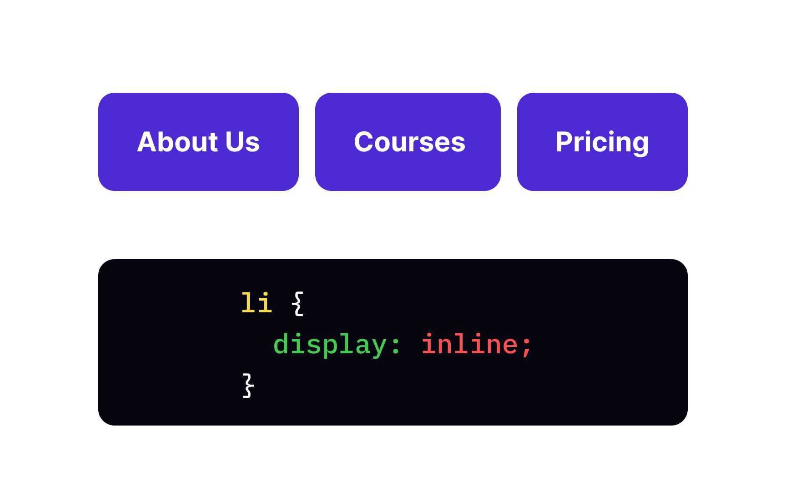

### Visualización de bloque y línea (inline-block)

El display inline-block combina las ventajas de bloque de colocar medidas al elemento y propiedades del modelo de caja correctamente; con las ventajas de inline de color un elemento seguido de otro en el mismo espacio.

Si elemento excede el contenido total, se coloca en la siguiente línea por debajo.

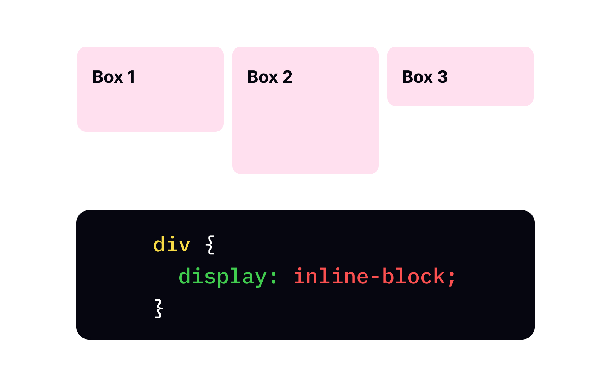

### Visualización nula (none)

El display none desactiva la visualización de un elemento, como si el elemento no existiera.

### CSS Layouts

El display flex y grid son formas de visualización de elementos recientes y cada uno tienen sus propias características para crear interfaces de manera efectiva, a partir de un contenedor padre que dotará a los elementos hijos de superpoderes del posicionamiento.

Ambas son herramientas muy útiles en el desarrollo, especialmente para la creación de interfaces amigables al usuario y aptas para cualquier dispositivo, que este último se lo conoce como responsive design.

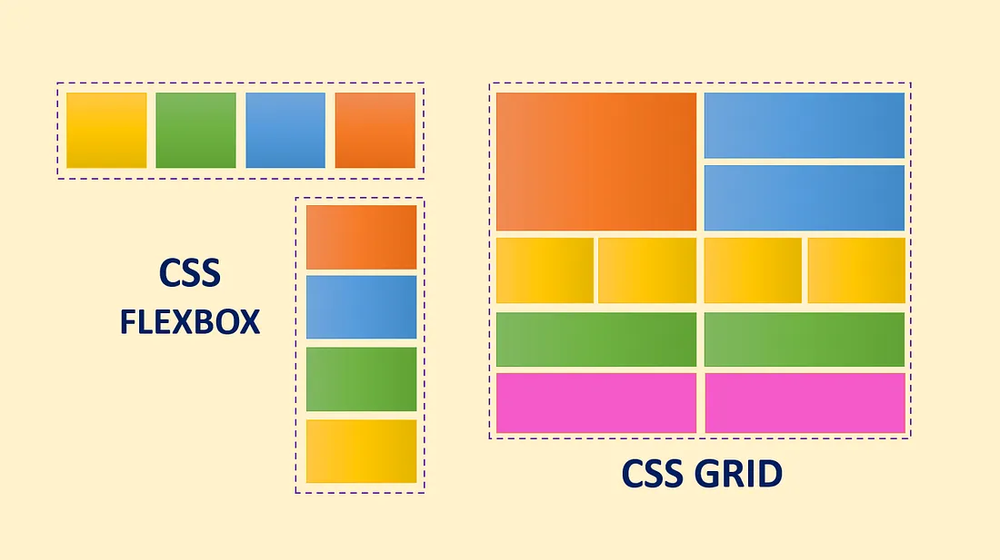

#### Flexbox

Flexbox consiste en el ordenamiento de elementos hijos en un solo eje, por defecto horizontalmente. El elemento padre o contenedor deberá contener la propiedad display con el valor flex. A partir de aquí, ya puedes ordenar los hijos según sea necesario.

#### Grid

Grid consiste en el ordenamiento de elementos hijos en dos ejes, como si fuera una cuadrícula o tabla. El elemento padre o contenedor deberá contener la propiedad display con el valor grid y debes definir las medidas de las columnas y de las filas. A partir de aquí, ya puedes ordenar los hijos según sea necesario.

[🡡 volver al inicio](#tabla-de-contenido)

## Modelo de caja

El modelo de caja se compone de cuatro elementos: margin, border, padding y contenido.

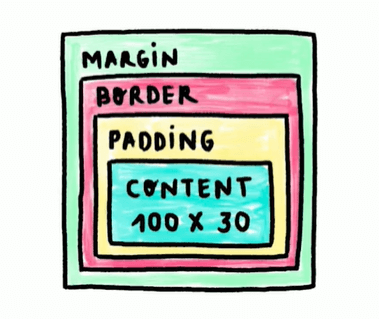

Si entras a las herramientas de desarrollador de tu navegador y señalas un elemento HTML, en la sección de estilos te aparecerá una vista parecida a la anterior imagen, este es el modelo de caja del elemento señalado.

### Qué es el contenido del elemento HTML

El contenido del elemento, como su nombre lo indica, es todo lo que está dentro del elemento. Este tiene medidas establecidas por las propiedades width y height, que representan la anchura y la altura, respectivamente. Si imaginamos una caja, este valor sería todo lo que decidas colocar dentro.

```css
div {
  width: 100px;
  height: 100px;
}
```

### Qué son los bordes del elemento HTML

El border consiste en el perfil o borde de un elemento HTML. Si imaginamos una caja, sería la caja en sí. Para definir un borde es necesario utilizar las siguientes tres propiedades:

- border-color: establece el color del borde.
- border-style: establece el estilo propio del borde, estos pueden ser: none (sin borde), dotted (puntos), dashed (guiones), solid (continuo), double (doble continuo), groove (recuadro).
- border-width: estable la anchura del borde.

También se puede establecer los tres valores en una sola propiedad border donde no importa el orden.

```css
div {
  border: [color] [style] [width];
}

div {
  border-color: red;
  border-style: solid;
  border-width: 1px;
}
```

También estableciendo de manera individual los valores de cada posición:

```css
div {
  border-top: 5px solid blue;
  border-bottom: 5px solid red;
  border-left: 5px solid black;
  border-right: 5px solid yellow;
}
```

### Qué es el espaciado interno del elemento HTML o padding

El padding consiste en el espacio entre el borde y el contenido del elemento HTML. Si imaginamos una caja, este valor sería el espacio entre la caja y lo que deseas guardar.

```css
div {
  padding: 100px;
}
```

Puedes establecer el padding en cada posición en una sola línea de las siguientes maneras:

- padding: [arriba] [derecha] [abajo] [izquierda], siguiendo el sentido horario.
- padding: [arriba] [derecha e izquierda] [abajo], siguiendo el eje principal.
- padding: [arriba y abajo] [derecha e izquierda], siguiendo los ejes del elemento.

También estableciendo de manera individual los valores de cada posición:

```css
div {
  padding-top: 10px;
  padding-bottom: 15px;
  padding-left: 20px;
  padding-right: 10px;
}
```

### Qué es el espaciado externo del elemento HTML o margin

El margin consiste en el espacio entre el borde y otro elemento HTML. Si imaginamos una caja, es el espacio entre tu caja y otra caja.

```css
div {
  margin: 10px;
}
```

Puedes establecer el margin en cada posición en una sola línea de las siguientes maneras:

- margin: [arriba] [derecha] [abajo] [izquierda], siguiendo el sentido horario.
- margin: [arriba] [abajo] [derecha e izquierda], siguiendo el eje principal.
- margin: [arriba y abajo] [derecha e izquierda], siguiendo los ejes del elemento.

También estableciendo de manera individual los valores de cada posición:

```css
div {
  margin-top: 10px;
  margin-bottom: 15px;
  margin-left: 20px;
  margin-right: 10px;
}
```

### Qué son los valores por defecto

Por defecto, el navegador establece valores iniciales a algunas propiedades CSS, este es el caso de margin y padding. Una buena práctica es utilizar el selector universal para restablecer estos valores a 0, para que no surjan errores inesperados.

```css
* {
  margin: 0;
  padding: 0;
}
```

### Qué es el tamaño total del elemento

El tamaño total del elemento está determinado por la suma de los valores de las propiedades border padding y widtho height, dependiendo del eje. La propiedad margin no está incluida en este cálculo.

Por ejemplo, definimos los siguientes estilos:

```css
div {
  width: 150px;
  height: 150px;
  padding: 20px;
  border: 10px solid gray;
  margin: 30px;
}
```

El tamaño total del elemento será de 210px en ambos ejes, donde la suma fue: 150 (altura/anchura) + 20 x 2 (padding ambos lados) + 10 x 2 (borde ambos lados). Si evaluamos este elemento en las herramientas del desarrollador mostrará su tamaño como 210x210.

Aunque se conozca las medidas de los elementos de esta manera, no siempre existirá un control total. Por lo que podríamos establecer el tamaño total del elemento con width y height, y no solo del contenido, añadiendo la propiedad box-sizing.

### Propiedad box-sizing

La propiedad box-sizing establece cómo se calculará el width y el height si incluyen bordes y espacios internos. Como buena práctica, se lo coloca en el selector universal, para que todos los elementos sigan esta tendencia.

```css
* {
  box-sizing: border-box;
}
```

Con el valor border-box, el tamaño total del elemento será igual al especificado en el width y height, provocando que las medidas del contenido cambien con respecto a los bordes y espacios internos.

El tamaño total del elemento será de 150px en ambos ejes, donde se calcularon las medidas del contenido para que la suma total sea lo especificado en el width y height. Si evaluamos este elemento en las herramientas del desarrollador mostrará su tamaño total como 150x150 y el contenido como 90x90.

Conclusión, establece las medidas totales del elemento con width y height, junto con box-sizing: border-box, para que el contenido se adecue a las necesidades del contenedor.

### ¿Cuál es el problema con el tamaño de los bordes?

Recapitulando, el tamaño total de un elemento es la suma de tres: el borde, el espacio interior y el contenido.

Entonces, en algunas ocasiones tendrás la intención de añadir un borde al realizar un hover. Esto provocará que el elemento necesite más espacio del inicial, en un contenedor con más elementos puede ocasionar un conflicto.

La solución a esto es colocar un borde de color transparent (transparente) y del mismo tamaño que el otro borde. Esto hará que el elemento se mantenga en su tamaño total, lo único que cambia es el color.

[🡡 volver al inicio](#tabla-de-contenido)

## Colapso de márgenes

El colapso de márgenes sucede cuando dos elementos bloque adyacentes tienen un determinado valor de margin, entonces estos márgenes se solapan en un solo valor, el mayor de ambos.

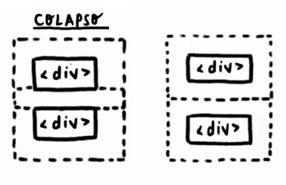

Como puedes observar, al cambiar el display este comportamiento desaparece. Además, en flexbox y grid no ocurre el colapso de márgenes. Cuida los márgenes que colocas en los elementos de tipo bloque.

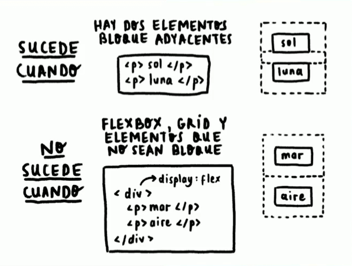

## Posicionamiento en CSS

El posicionamiento en CSS consiste en cómo un elemento se situará, con respecto a su elemento padre y al flujo normal del documento. El flujo normal del documento es el orden de los elementos establecidos en el HTML.

La posición del elemento se la define con la propiedad position, mediante los siguientes valores:

- static
- relative
- absolute
- sticky

### Propiedades de posición

Además de la propiedad position, existen cuatro propiedades del elemento de acuerdo a su posición con respecto a su padre, estas son: top (arriba), bottom (debajo), left (izquierda) y right (derecha).

```css
div {
  top: 10px;
  bottom: 15px;
  left: 20px;
  right: 10px;
}
```

Estos valores estarán establecidos en el padre próximo que tenga la posición relative.

Si top y bottom están definidos, top gana. Si left y right están definidos, left gana (dependiendo el idioma configurado).

### Posición estática

La posición static es el valor por defecto de todo elemento HTML, consiste en respetar el flujo normal del documento donde las propiedades de posición no pueden ser establecidas.

### Posición relative

La posición relative consiste en respetar el flujo normal del documento donde las propiedades de posición sí pueden ser establecidas.

### Posición absoluta

La posición absolute consiste en quitar al elemento del flujo normal del documento donde las propiedades de posición sí pueden ser establecidas.

Habrás notado que en realidad lo que sucede es que sitúa por detrás del elemento con posición absoluta que salió del flujo normal del documento. Este comportamiento se debe al eje Z de la pantalla y al contexto de apilamiento.

### Elemento padre más próximo con posición relativa

El elemento con posición absoluta se desplazará arriba, abajo, izquierda o derecha con respecto al elemento padre más próximo con posición relativa.

Si no existe un padre con posición relativa de un elemento con posición absoluta, este se desplazará con respecto al elemento raíz del documento.

Como pudiste observar, en el elemento con posición absoluta, su desplazamiento se basa con relación al elemento padre más próximo con posición relativa.

### Posición fija

La posición fixed consiste en quitar al elemento del flujo normal del documento y fijarlo en un lugar; donde las propiedades de posición sí pueden ser establecidas.

### Posición variable fija

La posición sticky consiste en quitar al elemento del flujo normal del documento y fijarlo en un lugar mientras su contenedor sea visible; donde las propiedades de posición sí pueden ser establecidas.

[🡡 volver al inicio](#tabla-de-contenido)

## Z-index y el contexto de apilamiento

El contexto de apilamiento consiste en la superposición de capas o elementos a lo largo del eje Z del navegador. Esto es importante para evitar que un elemento esté ocultando a otro.

### Qué son los planos y ejes

El navegador está constituido de tres planos y ejes: el ancho o X; el alto o Y; y el de profundidad o Z.

El eje X positivo está hacia la derecha; el eje Y positivo está hacia abajo; y el eje Z positivo está hacia el usuario.

Estos son muy importantes para mover los elementos del HTML desde un punto inicial hacia un punto final.

### Qué es la propiedad z-index

El contexto de apilamiento se configura con la propiedad z-index.

Por defecto, todos los elementos tienen un valor auto, es decir, el orden está definido por la estructura del HTML. Los primeros elementos estarán detrás y los últimos estarán de frente.

Si se establece un valor positivo, este elemento se sitúa por delante de los demás. Si se establece un valor negativo, se sitúa por detrás.

Si un elemento tiene un z-index mayor a otro, estará por delante. Sin embargo, si un elemento que tiene un z-index menor a otros, sus hijos nunca estarán por encima, aunque su z-index sea mayor.

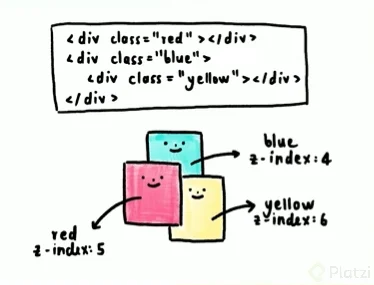

Como puedes observar en la imagen, el elemento con la clase yellow tiene un z-index mayor a red, pero no está por encima, porque su contexto de apilamiento está dentro del contexto de apilamiento del elemento blue, así mismo, nunca estará por detrás de su elemento padre.

[🡡 volver al inicio](#tabla-de-contenido)

## Unidades de medida

Las unidades de medida establecen una longitud para un determinado elemento o tipografía. Existen dos tipos de medidas: absolutas y relativas.

### Qué son las medidas absolutas

Las medidas absolutas son valores fijos, por lo que la medida no cambiará. La unidad absoluta más utilizada son los píxeles px, las demás son muy poco utilizadas, pero es bueno que las conozcas.

| Unidad | Nombre                | Equivalencia           |
| ------ | --------------------- | ---------------------- |
| px     | píxeles               | 1 px = 1/96 in         |
| cm     | centímetros           | 1 cm = 96/2.54 px      |
| mm     | milímetros            | 1 mm = 1/10 cm         |
| Q      | cuartos de milímetros | 1 Q = 1/4 mm           |
| in     | pulgadas              | 1 in = 2.54 cm = 96 px |
| pc     | picas                 | 1 pc = 1/6 in          |
| pt     | puntos                | 1 pt = 1/72 in         |

### Qué son las medidas relativas

Las medidas relativas son valores variables, por lo que la medida depende de un valor externo. Se debe tener en cuidado con estas porque un pequeño cambio puede desencadenar tamaños muy elevados.

| Unidad | Depende de                                            |
| ------ | ----------------------------------------------------- |
| em     | el elemento que lo contiene                           |
| rem    | el elemento raíz                                      |
| vw     | 1% del ancho de la pantalla (view width)              |
| vh     | 1% de la altura de la pantalla (view height)          |
| vmin   | 1% de la dimensión más pequeña de la pantalla         |
| vman   | 1% de la dimensión más grande de la pantalla          |
| ch     | anchura del caracter “0” del elemento que lo contiene |
| lh     | altura de la línea del elemento que lo contiene       |

### Diferencia entre rem y em

La medida em depende del elemento que lo contiene, es decir, si un elemento tiene font-size de 20px, el valor de em es igual a 20px, el valor de 2em será de 40px y así sucesivamente.

La medida rem depende del elemento raíz, el valor del font-size del elemento raíz es de 16px, por lo tanto, el valor de 2rem es igual a 32px, y así sucesivamente.

### Diferencia entre porcentajes y la anchura y altura de la pantalla

Los porcentajes representan el tamaño con respecto al total del elemento padre. Si el elemento padre tiene 20px, entonces el 100% será de 20px.

Por otra parte, las medidas de anchura vw y altura vh representan el tamaño con respecto al total de la pantalla. Si el elemento tiene un tamaño de 100vw será el 100 por ciento de la pantalla.

Si un elemento tiene todo el tamaño de la pantalla, entonces solamente en ese punto la medida 100% será igual a 100vw o 100vh.

### Problema con las medidas de texto

Los navegadores tienen una opción para cambiar el tamaño del texto. Con medidas absolutas, el tamaño de la letra no cambiará, por lo que será un problema para el usuario.

Con medidas relativas, el tamaño cambiará con respecto a la fuente del elemento raíz. Por lo que estas son una buena opción para solucionar este problema de accesibilidad, en específico la medida rem.

Sin embargo, la medida rem equivale a 16px y puede ser confuso mientras utilices valores altos. Por lo que vamos a cambiar el valor del elemento de la raíz para que la medida rem sea igual a 10px.

En la etiqueta `<html>` cambia el valor de la propiedad font-size a 62.5%, resultado de una regla de tres: si 16px es igual al 100% entonces cuál será el porcentaje para 10px.

```css
html {
  font-size: 62.5%;
}
```

Con este cambio, la medida rem será igual a 10px, ahora los puedes utilizar sin problema y tus textos cambiarán según las preferencias de usuario.

[🡡 volver al inicio](#tabla-de-contenido)

## Responsive Design

El diseño responsivo (Responsive Design) consiste en un conjunto de herramientas para que tu sitio se vea bien en varias medidas de pantalla, esto incluye imágenes, tipografía, internacionalización de la página y entre otros.

En la actualidad, la mayoría de sitios web son visitados desde un celular, por lo que asegurarse que nuestro sitio sea responsivo para cualquier dispositivo es fundamental para optimizar las ganancias.

### Qué son las media queries

Las media queries son reglas CSS que establecen un comportamiento distinto o diferentes estilos en un cierto rango de la pantalla. Esto sirve para establecer el layout del sitio web para diferentes tipos de pantalla: escritorio, tablets y celulares.

Estos son dos tipos de media querie :

- max-width / max-height: establece un rango máximo para cierto comportamiento.
- min-width / min-height: establece un rango mínimo para cierto comportamiento.

Estos valores son parecidos a condicionales, mientras se cumpla la condición, aplica determinados estilos.

### Estructura de la media querie

La estructura de una media querie consiste en empezar con @media, seguido del tipo de la media querie estableciendo un rango, envolviendo las reglas CSS dentro de ese rango.

```css
@media (max-width: 750px) {
  div {
    color: red;
  }
  p {
    background-color: red;
  }
}
```

[🡡 volver al inicio](#tabla-de-contenido)

## ¿Qué son las arquitecturas CSS?

Las arquitecturas CSS consisten en manejar el código CSS con una serie de reglas y patrones para facilitar su lectura, mantenibilidad y escabilidad.

El código que has manejado no se asemeja a la realidad, pues deberás manejar varios cientos o miles de líneas de código. Las arquitecturas CSS se encargan de manejar una norma en el código para que cualquiera pueda añadir o quitar funcionalidad sin mucho trabajo.

### Objetivos de las arquitecturas de CSS

- Ser predecible: el código debe ser lo menos complejo posible.
- Reutilizable: el código debe ser lo menos redundante, para evitar problemas con la especificidad.
- Mantenible: el código debe ser lo más fácil de manejar para añadir o quitar estilos.
- Escalable: el código debe ser capaz de crecer.

### Buenas prácticas de las arquitecturas de CSS

- Lineamientos y estándares: definir normas en tu grupo de trabajo de cómo estará escrito el código.
- Documentación: establecer una breve explicación del código y de los lineamientos, esto sirve especialmente para nuevas personas se familiaricen con lo que deben hacer.
- Componentes: establecer de manera componetizada cada uno de los elementos de tu página, es decir, manejarlos por partes para después unirlos en un todo.

### Qué es CSS orientado a objetos

La arquitectura OOCSS (Object Oriented CSS) consiste en separar la estructura principal y la piel o máscara.

En otras palabras, consiste en tener objetos que son estructuras principales. Estos objetos estarán unidos en una máscara, donde esta será la que cambie pero manteniendo la estructura intacta.

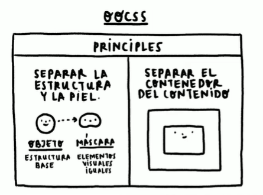

### Qué es BEM: bloque, elemento y modificador

La arquitectura BEM (Block-Element-Modifier) es una de las más utilizadas actualmente. Consiste en manejar los elementos en clases definidas por bloques, elementos y modificadores.

- Bloque: es la estructura principal que es contenedora de varios elementos.
- Elemento: es el elemento HTML que hace referencia el contenedor.
- Modificador: es un estilo específico para el elemento. Por ejemplo, un botón que tenga un color diferente a los demás, esto tiene relación con la especificidad.

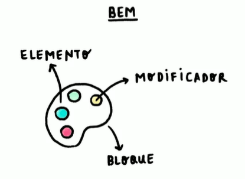

### Qué es la arquitectura escalable y modular de CSS

La arquitectura SMACSS (Scalable and Modular Architecture for CSS) indica el orden de componentes que estarán ubicados en carpetas. La unión de estos componentes dará como resultado tu página web con estilos.

- Base: elementos base, como botones, títulos, enlaces.
- Layout: estructura de la página, relacionado con el Responsive Design.
- Módulos: elementos que contienen a los elementos base.
- Estado: estilos relacionados con el comportamiento de elemento, relacionado con las pseudoclases y pseudoelementos.
- Temas: conjunto de estilos que definen tu página web.

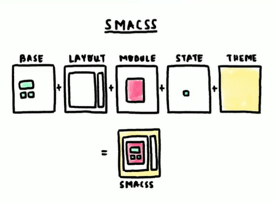

### Qué es el triángulo invertido de CSS

La arquitectura ITCSS (Inverted Triangle CSS) consiste en separar los archivos del proyecto; mediante ajustes, herramientas, elementos, entre otros. Todo esto para manejar los detalles de especificidad, claridad y magnitud.

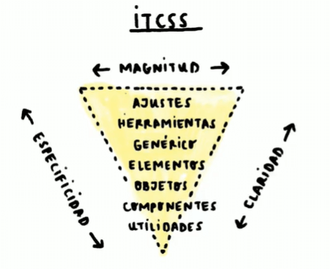

### Qué es el diseño atómico

La arquitectura Atomic Design también es una de las más utilizadas actualmente. Consiste en manejar los elementos como una estructura mínima, a partir de la unión de varias de estas, dará como resultado los estilos de la página web. Se basa en la estructura mínima de la materia, los átomos.

- Átomos: estructura mínima; como botones, enlaces, títulos, entre otros.
- Moléculas: unión de átomos.
- Organismos: unión de moléculas.
- Plantillas: unión de organismos.
- Páginas: unión de plantillas.

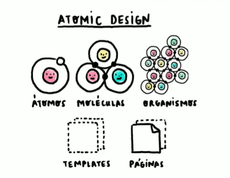

[🡡 volver al inicio](#tabla-de-contenido)
