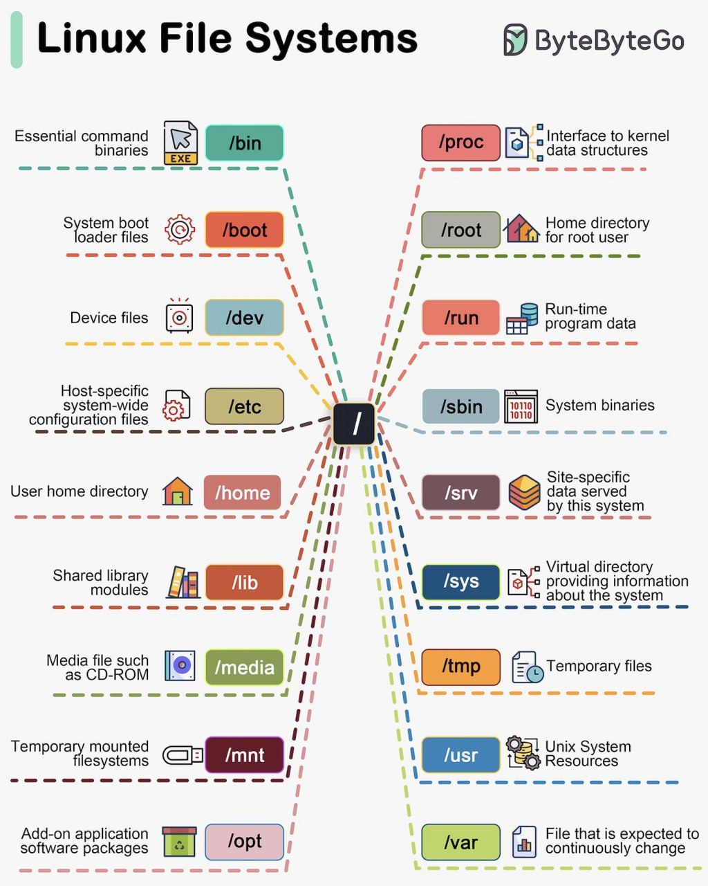

# Curso de Introducción a la Terminal y Línea de Comandos <!-- omit in toc -->

## Tabla de Contenido<!-- omit in toc -->

- [¿Qué es la terminal?](#qué-es-la-terminal)
  - [Concepto de terminal](#concepto-de-terminal)
  - [Concepto de shell](#concepto-de-shell)
  - [¿Por qué usar la shell y no la interfaz gráfica?](#por-qué-usar-la-shell-y-no-la-interfaz-gráfica)
- [Sistemas de Carpetas](#sistemas-de-carpetas)
  - [Cómo funciona el sistema de carpetas](#cómo-funciona-el-sistema-de-carpetas)
  - [Comandos Basicos de la terminal](#comandos-basicos-de-la-terminal)
- [Manipular Archivos y Directorios](#manipular-archivos-y-directorios)
  - [Vistazo rápido al contenido usando los comandos Head y Tail](#vistazo-rápido-al-contenido-usando-los-comandos-head-y-tail)
  - [Observar todo el contenido usando el comando Less](#observar-todo-el-contenido-usando-el-comando-less)
- [Comando](#comando)
  - [Ejemplos de comandos básicos de la terminal](#ejemplos-de-comandos-básicos-de-la-terminal)
  - [¿Cómo puedo saber qué comando estoy utilizando?](#cómo-puedo-saber-qué-comando-estoy-utilizando)
- [Wildcards](#wildcards)
  - [Tipos de wildcards](#tipos-de-wildcards)
- [Qué son las entradas y salidas de la terminal](#qué-son-las-entradas-y-salidas-de-la-terminal)
  - [Qué son file descriptors](#qué-son-file-descriptors)
  - [Cómo usar el operador de redirección (>)](#cómo-usar-el-operador-de-redirección-)
  - [Cómo concatenar (>>)](#cómo-concatenar-)
  - [Redirección de errores (2>|2>&1)](#redirección-de-errores-221)
- [Pipe operator](#pipe-operator)
  - [Comandos de pipe operator](#comandos-de-pipe-operator)
- [Operadores de Control](#operadores-de-control)
  - [Comandos en la misma línea (;)](#comandos-en-la-misma-línea-)
  - [Comandos asíncronos (&)](#comandos-asíncronos-)
- [Comandos con condicionales](#comandos-con-condicionales)
  - [Condición and (&&)](#condición-and-)
  - [Condicional or (||)](#condicional-or-)
  - [Combinando operadores de control](#combinando-operadores-de-control)
- [Permisos](#permisos)
  - [Tipos de archivos](#tipos-de-archivos)
  - [Permisos de usuario](#permisos-de-usuario)
    - [Owner](#owner)
    - [Group](#group)
    - [World](#world)
  - [Representando permisos de forma octal](#representando-permisos-de-forma-octal)
  - [Cambiar los Permisos](#cambiar-los-permisos)
  - [Cómo gestionar usuarios (whoami | su)](#cómo-gestionar-usuarios-whoami--su)
    - [Tabla de comandos whoami, su y chmod](#tabla-de-comandos-whoami-su-y-chmod)
- [Variables de entorno](#variables-de-entorno)
  - [¿Cómo crear tus propias variables de entorno?](#cómo-crear-tus-propias-variables-de-entorno)
- [Búsqueda en la Terminal](#búsqueda-en-la-terminal)
  - [Segmentar por el nombre (-name)](#segmentar-por-el-nombre--name)
  - [Segmentar por el tipo (-type)](#segmentar-por-el-tipo--type)
  - [Segmentar por tamaño (-size)](#segmentar-por-tamaño--size)
  - [Buscar vacíos (-empty)](#buscar-vacíos--empty)
  - [Limitar la búsqueda (-maxdepth -mindepth)](#limitar-la-búsqueda--maxdepth--mindepth)
- [Comando GREP](#comando-grep)
  - [Ignorar case sensitive (-i)](#ignorar-case-sensitive--i)
  - [Contar ocurrencias (-c)](#contar-ocurrencias--c)
  - [Excluir una expresión (-v)](#excluir-una-expresión--v)
  - [Limitar la búsqueda (-m)](#limitar-la-búsqueda--m)
- [Utilidades de Red](#utilidades-de-red)
  - [Configuración de tus dispositivos (ifconfig)](#configuración-de-tus-dispositivos-ifconfig)
  - [Enviar solicitudes a una página (ping)](#enviar-solicitudes-a-una-página-ping)
  - [Limitar los paquetes enviados (-c)](#limitar-los-paquetes-enviados--c)
  - [Especificar el tamaño de los paquetes (-s)](#especificar-el-tamaño-de-los-paquetes--s)
  - [Obtener el archivo de una página (curl | wget)](#obtener-el-archivo-de-una-página-curl--wget)
  - [Ruta de acceso a la página (traceroute)](#ruta-de-acceso-a-la-página-traceroute)
- [Comprimir Archivos](#comprimir-archivos)
  - [Comprimiendo archivos con formato .tar](#comprimiendo-archivos-con-formato-tar)
  - [Comprimir (-c)](#comprimir--c)
  - [Ver lo que está haciendo el comando (-v)](#ver-lo-que-está-haciendo-el-comando--v)
  - [Comprimir con formato ".tar.gz" (-z)](#comprimir-con-formato-targz--z)
  - [Descomprimir (-x)](#descomprimir--x)
  - [Comprimiendo archivos .zip](#comprimiendo-archivos-zip)
  - [Tabla de comandos tar y zip](#tabla-de-comandos-tar-y-zip)
    - [Opciones del comando tar](#opciones-del-comando-tar)
    - [Comando zip](#comando-zip)
- [Manejo de Procesos](#manejo-de-procesos)
  - [Ver los procesos activos en la terminal (ps)](#ver-los-procesos-activos-en-la-terminal-ps)
  - [Ver procesos más detallados (top)](#ver-procesos-más-detallados-top)
  - [Matar un proceso (kill)](#matar-un-proceso-kill)
  - [Tabla de comandos para manejo de procesos en la terminal](#tabla-de-comandos-para-manejo-de-procesos-en-la-terminal)
- [Editores de texto en la terminal](#editores-de-texto-en-la-terminal)
  - [Cómo usar Vim en la terminal](#cómo-usar-vim-en-la-terminal)
  - [Tabla de comandos para uso de Vim](#tabla-de-comandos-para-uso-de-vim)

## ¿Qué es la terminal?

La terminal es un programa que ejecuta líneas de comandos, que a su vez estas líneas de comando ejecutan acciones y aquí tienes que aprender dos conceptos: terminal y shell.

### Concepto de terminal

Estamos muy acostumbrados a que en nuestra computadora inicie un sistema operativo que tenga un sistema de ventanas en el que podemos abrir carpetas y programas y podamos mover archivos a través de una interfaz gráfica.

La terminal es otra ventana más, es un programa, una interfaz que recibe un comando para luego pasárselo a la shell y que esta última la ejecute. Con este programa podemos hacer todo lo que el sistema de carpetas e interfaz gráfica del sistema operativo puede hacer, pero utilizando comandos.

### Concepto de shell

Ahora la terminal no ejecuta líneas de código, solo la recibe, es la shell quien hace todo el proceso de tomar el comando, ir con el procesador y la memoria RAM y decirles "tomen, ejecuten esto".

Si lo pensamos de otra forma, la shell nos proporciona una forma de comunicarnos con el procesador y la RAM sin tener que pasar por la interfaz gráfica.

### ¿Por qué usar la shell y no la interfaz gráfica?

Al final del día, la interfaz gráfica, como lo es el sistema de ventanas, es un programa más y como programa que se ocupa espacio en la memoria.

La terminal es mucho menos pesada que el sistema de ventanas y el sistema de ficheros porque te comunicas directamente con los recursos del sistema operativo sin pasar por la interfaz gráfica.

Además, hay casos en los que no cuentas con una interfaz gráfica o también puede dañarse y tendrás que resolver utilizando la terminal de comandos.

[🡡 volver al inicio](#tabla-de-contenido)

## Sistemas de Carpetas

En los sistemas operativos organizamos los archivos en una estructura de carpetas en forma de árbol jerárquico. Este árbol cambia dependiendo de los diferentes sistemas operativos.

### Cómo funciona el sistema de carpetas

El sistema operativo con el que trabajaremos es Linux, por lo tanto usaremos su estructura.

La carpeta con el símbolo "/" es la raíz, ahí es donde comienza todo el sistema de ficheros (el equivalente en Windows podría ser el fichero "C:\"). Dentro de esta carpeta hay varios ficheros, el que nos importa en este momento es el "Home".

La carpeta "Home" contiene una carpeta por cada usuario del sistema y ya dentro de cada una de estas carpetas, estarán las carpetas que conocemos de toda la vida como imágenes, documentos, música, etc.

### Tu primer comando (pwd)

Ahora sí, vamos con el poderosísimo comando que te ayudará a descubrir algo muy importante: ¿dónde estás?

Vimos que el símbolo ~ indica la carpeta donde te encuentras, ¿cuál es esa carpeta? Para saberlo escribe el siguiente comando:

    pwd

El comando pwd, significa Print Working Directory y te muestra el directorio en el que te encuentras.

### Usar el comando Change Directory (cd)

No trabajarás todo desde la misma carpeta, así que necesitas saber como moverte entre carpetas sin salir de la terminal. Para eso usamos el comando cd que significa Change Directory.

Para usarlo escribimos cd seguido del directorio al que queremos movernos, por ejemplo, dentro del home tengo la carpeta Documents, así que para moverme ahí escribo:

    cd Documents

Y ahora vemos que la información que nos muestra la consola cambió y nos indica donde estamos:

    ~/Documents$

### Comandos Basicos de la terminal

Listar archivos:

    ls

Listar archivos para ver su peso de una manera mas mas legible

    ls -lh

Listar archivos ocultos:

    ls -a

Identificar la ruta en la que estamos en nuestro sistema:

    pwd

Movernos entre directorios:

    cd [directorio]

Crear un directorio:

    mkdir [nombre]

Copiar un archivo:

    cp [nombreDelArchivoParaCopiar] [nombreParaLaCopia]

Borrar un archivo:

    rm  [nombreDelArchivoParaEliminar]

Mover un archivo:

    mv [archivoParaMover] [destinoDelArchivo]

Borrar un directorio:

    rmdir [directorio]

Limpiar la terminal

    clear

[🡡 volver al inicio](#tabla-de-contenido)

## Manipular Archivos y Directorios

Al manipular archivos y directorios necesitas aprender cómo verlo. A continuación te explicamos lo que debes hacer.

### Vistazo rápido al contenido usando los comandos Head y Tail

En español, cabeza y cola tienen una funcionalidad muy sencilla, head imprime las primeras 10 líneas de un archivo y tail imprime las 10 últimas líneas.

La sintaxis de ambos es bastante sencilla, solo tienes que escribir el nombre del documento que quieres revisar delante del comando que quieras usar.

Pero hay algo más, si no quieres ver las primeras líneas, sino que quieres ver las primeras 20, por ejemplo, entonces usas la opción -n seguida del número de líneas que quieres ver.

    head proyecto.html -n 20

### Observar todo el contenido usando el comando Less

¿Y qué tal si quieres ver todo el documento? Pues siguiendo la sintaxis de head y tail escribes el nombre del archivo que quieres abrir delante del comando less.

    less [nombreDelArchivoParaAbrir]

Ahora tendrás una especie de interfaz gráfica donde podrás inspeccionar el documento. Puedes usar las flechas y el scroll para moverte arriba y abajo.

Además, puedes buscar palabras dentro del documento. Si presionas la tecla slash "/", en la parte de abajo se habilitará un cuadro donde podrás buscar palabras, solo escribe y presiona enter.

Para salir de la interfaz presiona "q".

[🡡 volver al inicio](#tabla-de-contenido)

## Comando

Un comando es un mensaje enviado al ordenador que provoca una respuesta en este sistema y se comporta como una orden, pues informa al dispositivo informático que debe ejecutar una acción según la indicación que pueda enviarse.

Cada sistema operativo incorpora un determinado número de comandos básicos, que permiten ejecutar las tareas más simples con órdenes directas. A continuación conocerás todo lo relacionado con sistemas operativos basados en UNIX y sus comandos básicos en la terminal.

Un comando pueden significar cuatro cosas:

1. Un programa ejecutable
2. Un comando de utilidad de la shell. Esto es un programa en sí mismo, que puede tener funciones. Ejemplo cd
3. Una función de shell. Son funciones de shell externas al comando de utilidad. Ejemplo mkdir
4. Un alias. Un ejemplo es ls

### Ejemplos de comandos básicos de la terminal

Ahora conocerás varios tipos de comandos que puedes aplicar en el proyecto que estás realizando.

- type [comando]: Nos permite conocer qué tipo de comando es 🤔.
- alias l="[secuencia de comandos]": Nos permite crear comandos. Son temporales, se borran al cerrar la terminal 👶🏼.
- help [comando]: Nos permite consultar un poco de documentación de un comando 📄.
- man [comando]: De manual, nos permite conocer mucha más información de un comando.
- info [comando]: Similar al anterior, pero un poco resumido y con otro formato.
- whatis [comando]: Describe un comando en una sola línea ☺️. No funciona con todos.

### ¿Cómo puedo saber qué comando estoy utilizando?

Puedes introducir type ls para ver qué tipo de comando es ls.

Ahora, podemos crear nuestro propio comando con un alias llamado l:

    alias l="ls -lh"

Podemos invocar a nuestro nuevo comando lcada vez que lo necesitemos y se ejecutará lo que está entre comillas, ¿cuál es el problema?

Si cerramos y volvemos a abrir la terminal, este alias se pierde.

Puedes implementar zsh, y pues ni el comando help ni man con cd, pero el comando man sí me funciona con git y otros comandos.

Un que se menciona en este recurso es:

    whatis ls

el cual nos dirá qué tipo de comando y qué hace ls.

[🡡 volver al inicio](#tabla-de-contenido)

## Wildcards

Las wildcards o comodines son una serie de caracteres especiales que nos permiten encontrar patrones o realizar búsquedas más avanzadas. Es aplicable para archivos y directorios.

Las wildcards te sirven para realizar seccionamiento de archivos o directorios, ademas de ls los wildcards tambien pueden usarse con cualquier comando que realice la manipulación de archivos como mv, cp y rm.

### Tipos de wildcards

- Buscar todo (\*): El asterisco te ayuda a buscar toda la información dentro de una carpeta, pero puedes limitar su uso. Si por ejemplo quieres buscar los archivos que tengan una extensión ".png", escribes:

      ls -l *.png

  También lo puedes poner al final, si quisieras buscar, todos los archivos que comiencen por unos caracteres específicos, entonces escribes esos caracteres y luego el asterisco.

- Buscar por cantidad de caracteres (?): Si dentro de tus archivos tuvieras una especie de código para guardar tus fotos, algo así como "foto1.png", "foto2.png", "foto3.png", etc. En este caso, sabemos que primero tenemos el string "foto", luego un solo número y por último la extensión ".png".

  Si quisieras buscar esas fotos escribirías:

      ls -l foto?.png

  También puedes combinar wildcards. Por ejemplo, si sabes que tus fotos siguen esta especie de código, pero no sabes que extensión tienen, escribes:

      ls -l foto?.*

  Aquí estás indicando:

  - Busca todo lo que comience por "foto".
  - Que inmediatamente después tenga un solo caracter.
  - Y que tenga lo que sea después del punto

- Buscar por caracteres específicos ([]): Si quieres buscar por varios caracteres específicos se usan corchetes. Para utilizarlos tienes que colocar dentro de los corchetes los caracteres que quieres buscar.

  Por ejemplo, si quisieras buscar los archivos que comiencen por las letras "c" o "i", entonces escribes:

        ls -l [ci]*

  Lo que indica el comando es que busque los archivos que comiencen por la letra "c" o por la letra "i" y que tengan lo que sea por delante. Cuando buscamos con esta wildcard ten en cuenta que es case sensitive, por lo que la letra "i" no es lo mismo que la letra "I".

        ls -l [cCiI]*

  Por último, si quieres buscar por rango de números también tienes que usar esta wildcard. Para hacerlo, escribe el rango de números que quieres buscar separados por un guion.

        ls -l foto[2-6]*

  Lo que indica ese comando es:

  - Busca todo lo que comience por la cadena de texto "foto".
  - Que justo después tenga un número entre el 2 y el 6.
  - Y que tenga lo que sea por delante.

[🡡 volver al inicio](#tabla-de-contenido)

## Qué son las entradas y salidas de la terminal

En la consola nosotros generamos una entrada cuando escribimos y una salida casi siempre que ejecutamos un comando.

A las entradas típicamente se les suele llamar Standard Input y a las salidas Standard Output, además se les suele abreviar como stdin y stdout respectivamente.

### Qué son file descriptors

Los file descriptors son números que identifican un recurso. Funciona asociando un número con una acción, archivo o programa, en el caso de la shell tenemos 3 file descriptors:

- stdin (0): Entrada estándar.
- stdout (1): Salida estándar.
- stderr (2): Salida de errores.

### Cómo usar el operador de redirección (>)

A veces queremos guardar la información de una salida porque nos puede interesar almacenar lo que esa salida contiene.

Lo que sucede aquí es que le diste un Standard Input (el comando) y obtuviste un Standard Output (la lista de archivos).

Si quieres que el Standard Output no vaya a la consola sino hacia un archivo, entonces puedes usar el operador > seguido del nombre del archivo en el que quieres guardar la salida.

    ls -l > output.txt

### Cómo concatenar (>>)

Suponiendo que ya tienes el archivo output.txt y ahora también quieres guardar la información de la carpeta de documentos, entonces no puedes volver a ejecutar: ls -l > output.txt Esto lo que hará es reescribir el contenido del documento, lo que necesitas es concatenar el contenido del documento con el de la salida, para eso ejecutas: ls -l >> output.txt

La salida del comando ls -l se concatenó con la salida del comando ls -l ./SecretosDeEstado. Te puedes dar cuenta porque la palabra total se repite dos veces.

Por cierto, esa palabra total es el tamaño total de la carpeta en kilobytes y dice que la carpeta SecretosDeEstado pesa 0, porque los archivos y carpetas vacías no ocupan espacio.

### Redirección de errores (2>|2>&1)

El operador de redirección por defecto solo redirecciona el file descriptor 1 (es decir, el Standard Output). Pero, ¿qué tal si queremos redirigir un error? Pues tenemos que especificar que queremos el Standar Error, que tiene el file descriptor 2.

También podemos especificar que no importa lo que pase si me da un Standar Ouput o un Standar Error, igual tiene que guardar la salida en un archivo. Esto lo hacemos así:

    ls -l > output.txt 2>&1

La orden 2>&1 significa que debe redirigir el file descriptor 2 y el file descriptor 1.

En la primera ejecución del comando, se ejecuta correctamente y guarda el Standar Output, pero en la segunda ejecución, el comando falla y guarda el Standar Error.

[🡡 volver al inicio](#tabla-de-contenido)

## Pipe operator

Pipe operator es un operador que permite tomar la salida de un comando y pasarla como entrada de otro comando. Aprendamos más comandos que te van a ayudar.

### Comandos de pipe operator

- Unir cadenas de texto (cat)

  Si queremos crear una lista de los archivos de varias carpetas, podemos usar cat para concatenar la salida de varios de ellos. Por ejemplo, vamos a crear uno que tenga la lista de los archivos contenidos en la carpeta "Images" y "SecretosDeEstado".

- Crear un archivo con base en una salida (tee)

  Si queremos guardar la lista creada anteriormente, podemos pasar esa salida por medio de un pipe operator al comando tee, el cual creará un archivo con esa salida.

      cat images.txt secretosDeEstado.txt | tee archivos.txt

  Por cierto, para ver los archivos usa el comando head , para que puedas ver la línea de comandos. Para inspeccionar archivos el comando less es mucho más efectivo.

- Organizar archivos con sort

  Puede ser algo complicado encontrar un archivo dentro de la lista, por lo que lo podemos organizar alfabéticamente una salida con el comando sort.

        ls | sort | tee archivosHome.txt

  Aquí lo que estamos haciendo es:

  - Listar los archivos
  - Organizar los archivos
  - Crear un archivo llamado archivosHome.txt, con las salidas anteriores

[🡡 volver al inicio](#tabla-de-contenido)

## Operadores de Control

Los operadores de control son símbolos reservados por la terminal que nos permiten encadenar comandos.

Si usas constantemente la tecla enter para ejecutar varios comandos, puedes evitarlo si usas el operador ; que separa los comandos que estamos ejecutando.

### Comandos en la misma línea (;)

Solo necesitas escribir los comandos que quieres ejecutar separados por ; y luego presionar enter.

        mkdir ProyectosSecretos; ls; date

Lo que sucedió es:

- Se creó un directorio llamado "Proyectos Secretos"
- Se listaron los archivos
- Se imprimió la fecha actual

El comando date imprime por consola la fecha actual.

### Comandos asíncronos (&)

Cuando queremos ser más eficientes podemos ejecutar varios comandos al mismo tiempo, de modo que no tenemos que esperar a que uno se ejecute para luego ejecutar el que sigue.

Para llevar a cabo varios comandos, al mismo tiempo, usamos el operador & entre cada comando que queremos ejecutar.

        date & echo "Hola" & cal

El comando cal imprime un pequeño calendario de la fecha actual y el comando echo imprime por el texto que le pases.

En la salida podemos ver que en la primera línea dice [1] 349 y en la tercera dice [2] 350, esto significa que se crearon dos hilos para ejecutar los 3 comandos que se le dieron.

El primero, con el id 349, se usó para ejecutar el comando date y el segundo, con el id 350 se usó para ejecutar los comandos echo y cal.

## Comandos con condicionales

Podemos ejecutar comandos dependiendo de condiciones.

### Condición and (&&)

Si escribimos varios comandos separados por el operador && estamos indicando que para que estos se ejecuten, el comando anterior tuvo que ejecutarse correctamente.

        cd lp && mkdir Comida

(Recuerda que el comando cd, Change Directory te cambia al directorio que le indiques).

En este ejemplo, intentamos cambiar al directrio "lp" pero ese directorio no existe, así que el comando falla y no se ejecuta el siguiente.

En caso de que el primer comando se haya ejecutado correctamente pasará al siguiente, y después verá si ese se puede ejecutar.

        cd ProyectosSecretos/ && touch ProyectoExplosivo.txt && ls

Como en este caso todos los comandos se ejecutaron correctamente sucede esto:

- Cambia el directorio "ProyectosSecretos"
- Crea el archivo "ProyectoExplosivo.txt"
- Lista el contenido del directorio con ls

### Condicional or (||)

Al condicional or no le importa si el comando anterior se ejecutó o no, simplemente va probando todos los comandos a ver cuál se ejecuta.

Por un momento vamos a suponer que no sabemos muy bien cuál es el comando para cambiar de directorio si es cd o cambia-carpeta, entonces para evitar un error escribimos:

        cd ProyectosSecretos/ || cambia-carpeta ProyectosSecretos/

Aquí vemos que alguno de los dos comandos está mal, pero igual cambió la carpeta porque uno de esos funcionó.

### Combinando operadores de control

Siguiendo con el ejemplo anterior, vamos a cambiar de directorio. Si se logra cambiar de directorio creamos una carpeta adentro.

        cd ProyectosSecretos/ || cambia-carpeta ProyectosSecretos/ && mkdir ProyectoIncreible

Esto funcionó porque el operador or devolvió verdadero al tener un comando que funcionara, por lo tanto, el operador and lo interpretó como un comando que funcionó correctamente.

[🡡 volver al inicio](#tabla-de-contenido)

## Permisos

Los permisos son las capacidades que tiene cada usuario dentro del sistema operativo, no todos los usuarios pueden hacer todas las acciones sobre ciertos archivos y carpetas.

Cuando listamos archivos utilizando el comando ls -l la primera columna que nos aparece es la de permisos.

### Tipos de archivos

El primer caracter puede ser uno de estos 3:

| Atributo | Tipo de archivo                                                                                             |
| -------- | ----------------------------------------------------------------------------------------------------------- |
| -        | Es un archivo normal, como un documento de texto, una foto, un video, etc.                                  |
| d        | Por directory es un directorio                                                                              |
| l        | Es un enlace simbólico. Es algo que veremos en próximas clases                                              |
| b        | Bloque especial, son archivos que manejan información para el sistema, como la información de un disco duro |

### Permisos de usuario

Los siguientes caracteres se leen de 3 en 3, por cada uno de los tipos de usuario.

#### Owner

El dueño del archivo, si no se ha cambiado, es quien lo creo y tiene mayor jerarquía sobre los otros 3. Le corresponden los primeros 3 caracteres de los permisos.

#### Group

Se puede crear grupos de usuarios para darle a todos o varios los mismos permisos. A estos usuarios le corresponden el cuarto, quinto y sexto caracter de los permisos de usuarios y tienen mayor jerarquía que el último.

#### World

También llamado "otros", es cualquier otro usuario que no pertenezca a un grupo de usuario y tampoco sea el dueño, este tiene la menor jerarquía.

Tipos de permisos

| Símbolo | Significado | Permiso                                                                            |
| ------- | ----------- | ---------------------------------------------------------------------------------- |
| r       | readable    | Significa que puede leer su contenido                                              |
| w       | writable    | El usuario puede editar el contenido del archivo, también el nombre y los permisos |
| x       | executable  | El usuario puede ejecutarlo en caso de que sea un programa                         |

Los permisos se escriben en ese orden rwx. Para indicar que el permiso no está disponible, se escribe un guion.

### Representando permisos de forma octal

Si organizamos los permisos de esta forma

| r   | w   | x   |
| --- | --- | --- |

E indicamos con un cero si el usuario no tiene el permiso y con un uno si el usuario si lo tiene, pongamos de ejemplo el permiso r-x:

| r   | w   | x   |
| --- | --- | --- |
| 1   | 0   | 1   |

Y ahora esos números los leemos en binario, nos quedaría así.

| r   | w   | x   | octal |
| --- | --- | --- | ----- |
| 1   | 1   | 1   | 7     |

Si repetimos esto con el resto de las combinaciones tenemos un número por cada combinación de permiso, por ejemplo el permiso r-x queda así:

| r   | -   | x   | octal |
| --- | --- | --- | ----- |
| 1   | 0   | 1   | 5     |

Usando todo esto podemos leer el conjunto de permisos rwxr-xr--, así:

| r   | w   | x   |     | r   | -   | x   |     | r   | -   | -   |
| --- | --- | --- | --- | --- | --- | --- | --- | --- | --- | --- |
| 1   | 1   | 1   |     | 1   | 0   | 1   |     | 1   | 0   | 0   |
|     | 7   |     |     |     | 5   |     |     |     | 4   |     |

[🡡 volver al inicio](#tabla-de-contenido)

### Cambiar los Permisos

Con el comando chmod podemos cambiar los permisos de los archivos de dos formas, una es usando los símbolos (rwx) y otra es con el sistema octal.

Es bastante sencillo cambiar los permisos de forma simbólica. Para esto, hay que escribir después del comando chmod el símbolo del usuario, luego el operador y por último el permiso que quieres agregar o quitar.

        chmod [simboloDelUsuario][operador][permiso] [archivoParaCambiarSusPermisos]

| owner       | group | others |
| ----------- | ----- | ------ |
| u (de user) | g     | o      |

| Operador | Función           |
| -------- | ----------------- |
| +        | Añade un permiso  |
| -        | Quita un permiso  |
| =        | Asigna un permiso |

Puedes cambiar varios permisos de varios usuarios al mismo tiempo, por ejemplo, si quisieras agregar el permiso de escritura y ejecución al grupo y a otros, sería así:

        chmod go+wx [archivo]

Y si quieres permisos diferentes para cada usuario, solo sepáralos por comas:

        chmod u+r,g=w [archivo]

En ese comando se le añadió el permiso de lectura al dueño y de escritura al grupo. No agregues espacio en las comas o provocarás un error.

También puedes cambiar los permisos usando su forma octal, por ejemplo el conjunto de permisos rwxr-xr-x en su forma octal es 755.

        chmod 755

### Cómo gestionar usuarios (whoami | su)

A veces podemos tener una crisis existencial y no recordar quienes somos, pero en vez de asistir a un terapueta le podemos preguntar a la terminal. El comnando whoami, literalmente "¿Quien soy yo?", te muestra cual es el usuario que se está ejecutando, esto es porque a veces podemos olvidar con cual usuario estamos trabajando.

Cuando listamos los archivos con ls -l la tercera columna muestra el nombre del usuario que es propietario del archivo y la cuarta columna muestra el grupo que tiene control sobre el archivo.

#### Tabla de comandos whoami, su y chmod

| Comando | Función                                              |
| ------- | ---------------------------------------------------- |
| whoami  | Muesta el usuario con el que se está trabajando      |
| su      | Switch User Cambia al usuario al que le especifiques |
| chmod   | Cambia los permisos de un archivo                    |
| chown   | Change Owner Cambia el propietario de un archivo     |

[🡡 volver al inicio](#tabla-de-contenido)

## Variables de entorno

Las variables de entorno son útiles cuando necesitamos que cierta información prevalezca para poder trabajar más rápido o necesitamos guardar información para no tener que recordarla constantemente.

En linux hay varias variables de entorno que ya están preestablecidas, para verlas desde la consola es tan simple como usar el comando seguido de la variable de entorno.

Por cierto, todas las variables de entorno se mandan a llamar con un signo de peso por delante, de lo contrario se interpretará como un comando.

| Variable     | Contenido                                                             |
| ------------ | --------------------------------------------------------------------- |
| HOME         | Indica el home del usuario                                            |
| PATH         | Indica las direcciones de donde están los binarios que usa el sistema |
| BASH_VERSION | Indica la versión del bash que estás utilizando                       |
| SHELL        | Dirección de la shell que estás utilizando                            |

Hay muchas más, pero estas son las que te pueden interesar. Por cierto, por convención las variables de entorno se crean en mayúsculas.

### ¿Cómo crear tus propias variables de entorno?

En el home de tu usuario debe haber un archivo oculto llamado ".bashrc", lo puedes ver ejecutando el comando ls -la la opción -a es de all. ls -la

Ábrelo utilizando el comando code .bashrc, si tienes instalado VS Code esto te mostrará el documento en el editor. Si estás en WSL y no te funciona, ve a la cmd, ejecuta el comando wsl y vuélvelo a intentar desde ahí.

Cuando lo abras ten cuidado con lo que tocas, podrías dañar la shell, pero desde ahí puedes crear una variable de entorno, por ejemplo, como yo estoy usando WSL, voy a crear una variable de entorno que me de la ruta de mi carpeta en Windows sin que tenga que escribir toda la ruta.

[🡡 volver al inicio](#tabla-de-contenido)

## Búsqueda en la Terminal

A veces necesitas localizar varios archivos del mismo tipo que ocupan espacio innecesario en tu disco duro.

Por ejemplo, algunos programas que funcionan desde la consola, como npm, guardan sus errores en archivos de extensión ".log" y si no estás pendiente de eliminarlos se van acumulando en tu disco duro.

¿Cuáles son los comandos de búsqueda en la terminal?
Para encontrar archivos de forma efectiva, usa el comando find, el cual buscará en la ruta que le indiques el tipo de archivos que necesitas. Su sintaxis es:

        find [rutaDesdeDondeEmpezarBuscar] [opciones]

### Segmentar por el nombre (-name)

Veamos un ejemplo, voy a buscar en mi carpeta home todos los archivos que tenga una extensión ".png".

        find ./ -name *.png

El punto indica que debe empezar desde la carpeta en la que está y la opción -name es para especificar el nombre que debe buscar.

### Segmentar por el tipo (-type)

También puedes segmentar por el tipo, si es un archivo o si es un directorio utilizando la opción -type, el cual acepta f para archivos, d para directorios y l para enlaces simbólicos.

Si quieres usar más de una opción lo separas por comas.

        find ./ -type f -name "f*"

Esto me muestra todos los archivos que comiencen con la letra "f".

Veamos un ejemplo buscando archivos y directorios.

        find ./ -type f,d -name "D*"

### Segmentar por tamaño (-size)

Con la opción -size podemos segmentar por tamaño ingresando el peso que queremos buscar. Esta opción tiene un uso un tanto especial. Primero que todo hay que colocar la unidad de peso c para byte, k para Kilobyte, M para Megabyte y G para Gygabyte. Entonces, si escribes en la terminal:

        find ./ -size 4k

Buscará los archivos que pesen exactamente 4kb. Pero claro, atinar el peso exacto de un archivo no es para nada sencillo, así que podemos especificar que sea ese peso en adelante con el símbolo + o de ese peso para abajo con el símbolo -.

        find ./ -size +4k

Busca los archivos que pesen 4kb o más.

        find ./ -size -4k

Busca los archivos que pesen 4kb o menos.

### Buscar vacíos (-empty)

Para buscar los archivos vacíos usamos la opción empty que es fácil de usar, no tienes que especificarle nada, solo escribirla.

Por ejemplo, si quisiera buscar todas las carpetas vacías, habría que escribir:

        find ./ -type d -empty

### Limitar la búsqueda (-maxdepth -mindepth)

Puede que no queramos buscar en absolutamente todas las carpetas del sistema, sino que queremos únicamente un pedacito. Para eso limitamos la profundidad de carpetas a la que el comando debe buscar, esto se hace con la opción -maxdepth seguido de la profundidad.

        find ./ -type d -maxdepth 2

Continuando, a veces ya conocemos más o menos la estructura de nuestras carpetas, así que nos queremos saltar niveles, por lo que le asignamos una profundidad mínima al comando.

        find ./ -type d -mindepth 2

Una última cosa, es recomendable pasar el output al comando less, así:

        find ./ | less

De esta forma podrás usar esa interfaz de less para buscar tus archivos.

Tabla de comandos de búsqueda

| Opción    | Función                         |
| --------- | ------------------------------- |
| -size     | Busca por el peso               |
| -mindepth | Asigna una profundidad mínima   |
| -maxdepth | Asigna una profundidad máxima   |
| -type     | Busca por el tipo de archivo    |
| -name     | Busca por el nombre del archivo |

[🡡 volver al inicio](#tabla-de-contenido)

## Comando GREP

"Grep" significa Global Regular Expression Print.

El comando grep utiliza regex (Regular Expression) para realizar su búsqueda, si no sabes como armar un regex aquí tienes el Curso de Expresiones Regulares

La sintaxis es sencilla: comando, lo que quieres buscar, archivo:

        grep [ExpresiónRegular] [archivoDondeBuscar]

En los recursos tienes un archivo llamado "movies.csv"; vamos a buscar palabras dentro de ese archivo:

        grep the movies.csv

Cómo usar el comando grep

### Ignorar case sensitive (-i)

Puede que queramos buscar la palabra "Action" pero eso dará exclusivamente las coincidencias con la "A" mayúscula. Esto lo podemos ignorar con la opción -i, que buscará independientemente de si la letra "A" es mayúscula o minúscula.

        grep -i Action movies.csv

### Contar ocurrencias (-c)

Si quieres saber cuántas veces se repite una palabra, usa la opción -c seguida de la palabra que quieres buscar.

        grep -c Drama movies.csv

### Excluir una expresión (-v)

Para saber cuáles son los resultados que NO coinciden con tu expresión regular, usas la opción -v.

Por ejemplo, si queremos contar todas las películas que no son de drama, escribimos:

        grep -cv Drama movies.csv

### Limitar la búsqueda (-m)

Para no buscar en todo el archivo, sino las primeras ocurrencias, podemos limitar la búsqueda en líneas con la opción -m seguida del número de líneas que queremos encontrar.

Por ejemplo, si queremos buscar las primeras 10 líneas que concuerden con la palabra "Fan" escribimos:

        grep -m 10 Fan movies.csv

Tabla de funciones de grep

| Opción | Función                          |
| ------ | -------------------------------- |
| -m     | Limita las líneas de la búsqueda |
| -c     | Cuenta las ocurrencias           |
| -v     | Excluye las ocurrencias          |
| -i     | Ignora él case sensitive         |

[🡡 volver al inicio](#tabla-de-contenido)

## Utilidades de Red

El manejo de redes es bastante amplio, de hecho, es toda una rama de la informática. Aquí aprenderás comandos básicos de utilidades de la red para que puedas obtener la información que necesites.

### Configuración de tus dispositivos (ifconfig)

Ve a tu consola, escribe el comando ifconfig y miremos el resultado.

Cuando ingresamos el comando podemos ver el nombre del dispositivo de red, en este caso es "eth0", y su configuración, tenemos su dirección IPv4 e IPv6 y su máscara de red.

También tienes la opción del comando netstat solo que te lo mostrará de forma más amigable usando una tabla.

### Enviar solicitudes a una página (ping)

A veces queremos saber si una página está disponible desde nuestra dirección IP. Para esto escribimos el comando seguido de la URL a la que queremos acceder.

El comando ping envía paquetes a esa página y evalúa el tiempo de respuesta.

Por defecto, el comando se ejecutará indefinidamente, así que tienes que detenerlo con ctrl + c.

        ping www.google.com

De esta salida obtuvimos la dirección IP de esa URL, también cuanto tiempo tardó en responder la página medida en milisegundos y en la parte de abajo tenemos el total de paquetes que se enviaron, los paquetes que se recibieron, el porcentaje de paquetes perdidos y el tiempo de respuesta promedio de las consultas.

Vamos a ver unas pocas opciones más de este comando.

### Limitar los paquetes enviados (-c)

Para limitar la cantidad de paquetes que enviamos, usamos la opción -c seguida del número de paquetes por enviar.

        ping -c 4 www.google.com

### Especificar el tamaño de los paquetes (-s)

Para probar la conectividad con paquetes de diferentes tamaños se utiliza la opción -s seguido del tamaño del paquete que desees usar. El tamaño debe ser en bytes.

Para hacer pruebas con paquetes de 20 bytes escribimos:

        ping -s 20 www.google.com

### Obtener el archivo de una página (curl | wget)

Podemos obtener archivos que nos proporcione un sitio web o dirección IP con el comando curl. Este te mostrará la información que haya encontrado en la consola.

        curl www.google.com

Al ejecutar este comando te dará el documento ".html" de Google, el cual lo verás como un montón de letras locas si estás empezando.

El comando wget hace algo similar, solo que en vez de mostrar lo que h obtenido por consola lo guarda en el archivo que le especifiques.

        wget www.google.com

La última línea de la salida del comando wget dice que la información fue guardada en el archivo "index.html", el cual podemos ver al listar los archivos.

También podemos específicar varias direcciones para descargar varias páginas al mismo tiempo.

        wget www.google.com www.platzi.com

Aquí vemos como se guardó la página de Google en "index.html.1" y la de Platzi en "index.html.2".

### Ruta de acceso a la página (traceroute)

Cuando nos conectamos a una página en internet no nos conectamos directamente a los servidores en los que está almacenada esa página, sino que primero pasamos por otros servidores que son como intermediarios entre tu computadora y el servidor.

Tabla de comandos de utilidades de red

| Comando  | Función                                                       |
| -------- | ------------------------------------------------------------- |
| ifconfig | Muestra la configuración de los dispositivos de red           |
| ping     | Envía paquetes a una dirección para comprobar su conectividad |
| curl     | Muestra por consola el archivo devuelto por la dirección      |
| wget     | Guarda el archivo devuelto por la dirección                   |

[🡡 volver al inicio](#tabla-de-contenido)

## Comprimir Archivos

Puedes aprender a crear archivos comprimidos .zip o .tar que vemos en nuestro sistema operativo. Estos encapsulan muchos archivos e incluso carpetas.

### Comprimiendo archivos con formato .tar

El formato .tar es un tipo de compresión bastante usado en UNIX. Originalmente era utilizado para almacenar información en cintas magnéticas, así que está hecho especialmente para comprimir los archivos de forma lineal.

Para comprimir con este formato en la terminal usamos el comando tar que tiene ciertas opciones para aprender.

        tar [opciones] [nombreDelArchivoComprimido] [archivoAComprimir]

### Comprimir (-c)

Para comprimir un archivo utilizamos la opción -c. En todos los casos hay que usar la opción -f para indicar que estamos comprimiendo o descomprimiendo archivos.

        tar -cf compressed.tar Documents/toCompress/

### Ver lo que está haciendo el comando (-v)

Si queremos ver lo que el comando está comprimiendo a medida que se va ejecutando, usamos la opción -v. Por cierto la opción -v es de "Verbose" y muchos comandos la usan, también te la puedes encontrar como --verbose.

        tar -cvf compressed.tar Documents/toCompress/

### Comprimir con formato ".tar.gz" (-z)

El formato ".tar.gz" o también ".tgz" es una versión extendida del formato tradicional de compresión ".zip" que puede manejar y comprimir archivos más grandes.

Para manejar la compresión de archivos ".tar.gz" o ".tgz" se usa la opción -z además de tener que especificar en el nombre de archivo la extensión que quieres usar.

        tar -czvf compressed.tar.gz Documents/toCompress/

### Descomprimir (-x)

Para descomprimir es mucho más sencillo, solo hay que especificar la opción -x y el archivo comprimido que se quiere descomprimir.

Si se quiere descomprimir un archivo de extensión ".tar.gz" o ".tgz" hay que especificar la opción -z también.

        tar -xzvf compressed.tar.gz

### Comprimiendo archivos .zip

Para comprimir usamos el comando zip con el nombre que quieres que tenga y lo que quieres comprimir.

Si quieres comprimir una carpeta con archivos dentro, tienes que especificar la opción -r de "recursive".

        zip -r copressed.zip Documents/toCompress/

Y para descomprimir es incluso más fácil, solo escribe el comando unzip seguido de lo que quieres descomprimir.

        unzip compressed.zip

### Tabla de comandos tar y zip

#### Opciones del comando tar

Recuerda siempre colocar la opción -f.

| Opción | Función                                                                                   |
| ------ | ----------------------------------------------------------------------------------------- |
| c      | Comprimir                                                                                 |
| x      | Descomprimir                                                                              |
| z      | Especifica que lo que se va a comprimir o descomprimir tiene extensión ".tar.gz" o ".tgz" |
| v      | Muestra lo que está comprimiendo o descomprimiendo                                        |

#### Comando zip

Recuerda que si lo que vas a comprimir es una carpeta tienes que usar la opción -r.

| Comando | Función     |
| ------- | ----------- |
| zip     | Comprimir   |
| unzip   | Decomprimir |

[🡡 volver al inicio](#tabla-de-contenido)

## Manejo de Procesos

Puedes manejar los procesos como visualizar, eliminar o filtrar desde la terminal de un modo diferente a usar ctrl + alt +suprimir. Te explicamos cómo lograrlo.

### Ver los procesos activos en la terminal (ps)

El comando ps muestra los procesos que están activos en una tabla muy sencilla de entender, donde el la primera columna tenemos el process ID y en la última el nombre.

### Ver procesos más detallados (top)

Si quieres ver una lista más detallada de los procesos con su consumo en CPU y en RAM, además del usuario que lo activó, usamos el comando top.

Aquí podemos filtrar por user. Si presionas la tecla "u" podrás escribir el nombre de usuario por el cual quieres buscar y si presionas la tecla "h" te mostrará un cuadro de ayuda para más opciones. Para salir presiona "q".

### Matar un proceso (kill)

Para matar un proceso usamos el comando kill seguido del PID del proceso que queremos matar.

Si estás usando Windows y tienes varias aplicaciones abiertas podrás usar la terminal para cerrarlas, pero para los que estamos usando WSL solo podemos acceder a los procesos que se ejecuten en la terminal.

Pero la teoría es la misma, buscamos el PID del proceso que queremos matar y lo matamos.

### Tabla de comandos para manejo de procesos en la terminal

| Comando | Función                                                                                                           |
| ------- | ----------------------------------------------------------------------------------------------------------------- |
| ps      | Muestra una tabla con los procesos que se están ejecutando                                                        |
| top     | Muestra una interfaz con los procesos que se están ejecutando más los recursos que consumen información adicional |
| kill    | Mata el proceso que le indiques                                                                                   |

[🡡 volver al inicio](#tabla-de-contenido)

## Editores de texto en la terminal

Una de las utilidades más importantes de la terminal es el editor de texto. Hay diferentes opciones, pero Vim es uno de los mas sencillos y populares. También está Emacs y Nano 🤔. Veamos con más detalle el uso de Vim.

### Cómo usar Vim en la terminal

Para abrir o crear un archivo utilizando Vim escribe el comando vim [nombre del archivo]

En mi caso voy a abrir uno que ya está creado.

Por defecto no podrás escribir hasta que actives el modo de inserción. Para hacerlo usa la tecla i.

Para salir del modo de inserción presiona la tecla escape. En el modo normal (en el que no puedes escribir) si escribes el slash / activarás un buscador similar al del comando less.

Para borrar una línea, estando el modo normal, tienes que ubicarte sobre ella y presionar dd.

Para guardar y salir presiona estando en el modo normal, activa los comandos usando : y escribe "wq". La letra "w" es para guardar y la letra "q" es para salir, también los puedes usar por separado.

Luego podemos revisar el contenido con el comando cat.

### Tabla de comandos para uso de Vim

| Comando     | Función                                            |
| ----------- | -------------------------------------------------- |
| vim         | Abre el archivo especificado. Si no existe lo crea |
| :q          | Cierra el editor                                   |
| :w          | Guarda los cambios                                 |
| /[busqueda] | Busca dentro del texto                             |
| dd          | En el modo normal, selecciona una línea y la borra |

[🡡 volver al inicio](#tabla-de-contenido)
